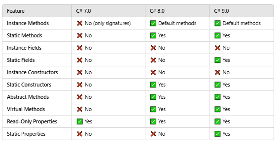

#### Difference between .NET & C# ?

.NET is a framework, c# is a programming language
.NET is a collection of libraries and it has a runtime

.NET framework runs only on windows
.NET Core is a cros platform 
.NET 5 provides a unified experience

In .NET Core, the libraries are split into .smaller, so that
we can import only what's needed instead of all as compared to .NET framework, so its faster compared to .nET framework
(Big dlls are converted into small pieces - more modular)

.NET core has CLI based support which isn't in .NET framework   


#### 3  :- What is IL ( Intermediate Language) Code ?   


Code is converted into IL (platform independent)
IL is partially compiled code( Intermediate language),
JIT compiler converts this into Machine language (based on the machine type - windows 8/10/linux)

The runtime and compile time env can ge diff, depending on runtime, JIT optimizes it as per that env

.NET support C#, VB.NET, F# etc, everything converts to IL

CLR is runtime exec of .NET
##### Main Components of CLR (Common Language Runtime)  

##### 1. Just-In-Time (JIT) Compiler  
- Converts **Intermediate Language (IL)** code into **machine code** at runtime.  
- Optimizes code execution for performance.  

##### 2. Garbage Collector (GC)  
- Automatically manages memory by reclaiming unused objects.  
- Helps prevent **memory leaks** and **improves performance**.  

##### 3. Common Type System (CTS)  
- Defines how types (int, string, object, etc.) are declared and used in .NET.  
- Ensures **type safety** across different .NET languages.  

##### 4. Common Language Specification (CLS)  
- Defines a set of rules that all .NET languages must follow.  
- Ensures **interoperability** between different .NET languages (e.g., C#, VB.NET, F#).  

##### 5. Code Access Security (CAS) [Deprecated]  
- Used in older .NET versions to enforce security policies for managed code.  
- Replaced by more modern security frameworks.  

##### 6. Exception Handling  
- Provides structured exception handling using `try-catch-finally`.  
- Ensures robust error management in applications.  

##### 7. Metadata and Reflection  
- **Metadata**: Stores information about classes, methods, properties, etc.  
- **Reflection**: Allows runtime access to metadata for dynamic type inspection.  

##### 8. Thread Management  
- Manages **multithreading** and parallel execution in .NET applications.  
- Optimizes CPU utilization for better performance.  


##### CLR in Action  
When you run a .NET application:  
1. The source code is compiled into **Intermediate Language (IL)**.  
2. The CLR loads the IL, verifies it, and passes it to the **JIT compiler**.  
3. JIT compiles IL into **machine code** for execution.  
4. CLR handles **memory management**, **security**, **exception handling**, and **garbage collection** during execution.  

CLR is the backbone of .NET, ensuring smooth execution, security, and memory management. 🚀*


####   What is managed and unmanaged code ?   
managed code - executes under CLR exec env.The CLR handles memory management, garbage collection, type safety, and exception handling.

unmanaged code - executes outside CLR boundary ( c, c++, vb6 etc), runs directly on OS without CLR sueprvision. Requries manual memory management and security


   


####  Explain the importance of Garbage collector ?   
It is a background process which keeps running continously and claims/frees unused managed resources
 In C#, the GC automatically handles memory cleanup, so developers don’t have to worry about:

Memory leaks
Dangling pointers
Buffer overflows
Heap fragmentation
   
Works in three phases : Mark phase > Sweep phase > Compact phase

Uses a generational model (Gen 0, Gen 1, Gen 2) for efficiency.


#### 11 :- Can garbage collector claim unmanaged objects ?   


   


#### 12 :- What is the importance of CTS ?   


   


#### 13 :- Explain CLS ?    


   


#### 14 :- Difference between Stack vs Heap ?   


   


#### 15 :- What are Value types & Reference types?   


   


#### 16 :- Explain boxing and unboxing ?   


   


#### 17 :- What is consequence of boxing and unboxing ?   


   


#### 18 :- Explain casting,implicit casting and explicit casting ?   


   


#### 19 :- What can happen during explicit casting ?   


   


#### 20 :- Differentiate between Array and ArrayList ?   


#### What is operator overloading & custom overloading ?

````
2 + 3 - 5
"sush" + "natha" - "sushnatha"

public static ComplexNumber operator +(ComplexNumber a1, ComplexNumber a2) 
{ 
    return new ComplexNumber( a1.real + a2.real, a1.imaginary + a2.imaginary );
}
````

#### Interfaces
 - can have properties
 - cannot have method implementation (can have from c# 8.0 )
 - all properties and functions are public and abstract by default


#### abstract vs interfaces

#### access specifiers

#### ref vs out

#### struct vs class

#### delegate and reflection

#### events


