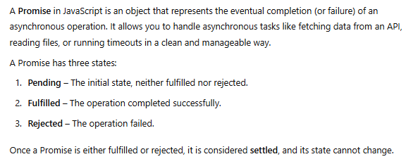
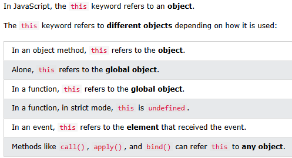

# Javascript

#### What is hoisting ?
Hoisting is JS behavior where all declarations are moved to top
var are given undefined value, where as let and const are not initialized by default value, they are in temporal dead zone until initialized. Accessing them before it gives reference error


### what are js modules ?
JavaScript modules allow you to break up your code into separate files.
```
<script type="module">
import message from "./message.js";
</script>
```

#### What are ES6/ features ?

import, export notation
Arrow functions - automatically capture the value of this from the surrounding context
let, const
spread operator
template literals -offer a cleaner way to handle string interpolation in JS
destructuring
classes
promises
default params
few string functions
few array functions

#### What is closure
A closure is a function that has access to the parent scope, after the parent function has closed.

Closures has historically been used to:
- Create private variables
- Preserve state between function calls
- Simulate block-scoping before let and const existed
- Implement certain design patterns like currying and memoization

```
function counter(){
    let count = 0;
    return function(){
        count = count + 1;
        return count
    }
}

const add = counter()
add() will return the incremented value
```


#### Shallow copy vs deep copy ?

In shallow copies, only the top-level properties are copied, not the values of nested objects (refereneces are copied)
-> Spread operator & Object.assign

```
//shallow copy
const obj = { a: 1, b: { c: 2 } };
const copy = { ...obj };
const copy = Object.assign({}, obj);
```

-> structuredClone(), JSON.parse(JSON.stringify())

``` 
// Deep copy

const obj = {
  a: 1,
  b: { c: 2 },
  doit: function () {
    console.log("nested function");
  },
  sample: { undefined },
};

const copy = structuredClone(obj);
// fast, built-in, not supported in old browsers

const copy = JSON.parse(JSON.stringify(obj));
// loses functions, undefined, date, symbol, set, map

import cloneDeep from 'lodash/cloneDeep';
const copy = cloneDeep(obj);
// handles all cases, but its an exteral library
```

#### What are call, apply, bind ?
It can be used to invoke (call) a method with an object as an argument (parameter). It allows to borrow method of another object
It accepts arguments individually

apply works the same way, but it expects an array as argments

bind, method, an object can borrow a method from another object

Incase of call, apply it will be invoked instantly, whereas
in borrow, that function can be used later point of time

```

const employee = {
   fname : "ravi",
   lname: "ranjan",
   getFullNameAge: function(age){
       return this.fname+" "+this.lname+" aged: "+age
   }
}

const newEmployee = {
    fname : "sush",
   lname: "natha",
}


console.log(employee.getFullNameAge(22))

console.log(employee.getFullNameAge.call(newEmployee, 35))
console.log(employee.getFullNameAge.apply(newEmployee, [35]))
const getDetails = employee.getFullNameAge.bind(newEmployee)
console.log(getDetails(50))
```
#### Callbacks , Promises


Callback hell or pyramid of doom



#### What is currying ?
Currying is a functional programming technique where a function does not take all arguments at once but instead returns another function that takes the next argument, and so on.
- Instead of fn(a, b, c), we write fn(a)(b)(c).
- It breaks down a function into multiple functions, each handling one argument.


Currying is useful in real-world applications when you need to create reusable, configurable functions.
 - Pre-configured Event Listeners, 
 - Reusable Validation Rules, 
 - Theming in React/Styled Components
 - Pre-configured Loggers
 
```
// Without Currying

function logMessage(level, message) {
    console.log(`[${level.toUpperCase()}] ${message}`);
}

logMessage("info", "Application started");
logMessage("warn", "Low memory");
logMessage("error", "System crash!");

// WIth Currying
const log = level => message => console.log(`[${level.toUpperCase()}] ${message}`);

// Pre-configured loggers
const info = log("info");
const warn = log("warn");
const error = log("error");

// Log messages
info("Application started");
warn("Low memory");
error("System crash!");

```

```
// Form validators with currying
const validate = field => minLength => value => {
    if (value.length < minLength) {
        console.log(`${field} must be at least ${minLength} characters.`);
    } else {
        console.log(`${field} is valid.`);
    }
};

// Pre-configured validators
const validateUsername = validate("Username")(5);
const validatePassword = validate("Password")(8);

// Validate user input
validateUsername("John"); // Output: Username must be at least 5 characters.
validatePassword("securePass"); // Output: Password is valid.
```

#### What is this keyword ?

```
const myPromise = new Promise((resolve, reject) => {
    setTimeout(() => {
        resolve("Operation Successful!");
    }, 2000);
});

myPromise
    .then(result => {console.log(result);})
    .catch(error => {console.log("Error:", error);});
```


#### What is 
