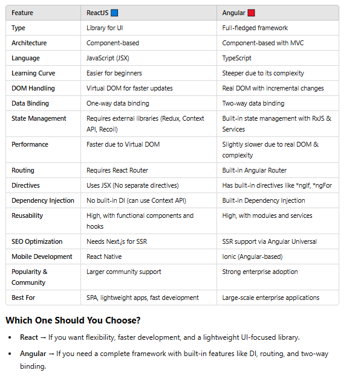

# React - Launched in 2013

from index.html, main.js and main.css will be called,
analyze the bundle
search for alternate libraries/import partial libraries

#### what is flow in react application ?
1) Transpilation ( es6 or es5 or so) - for browser compatibility
2) Compilation ( HighLevel code to MachineLevel code ) -  for the actual execution of code
3) bundling - COmbines multiple js files into one or few files, treeshaking ( removes unused js imports)
4) Minification - Removes whitespace, comments, shortens var names etc
5) Compression - GZip - Further reduces file size before sending to client

#### what are key features of React
- JSX
- Virtual DOM
- One-way data binding
- Hooks / Lifecycle methods
- Component based architecture
- Modular / Flexible
- Extensions : . React uses extensions to aid application building
- Huge ecosystem & community support

#### What is Flux in react ?
Flux is an architectural pattern used for managing state in ReactJS applications. It was introduced by Facebook to address the complexity of state management in large-scale applications. Flux consists of a unidirectional data flow, making it easier to understand and manage the state changes in an application.

#### What are limitations/drawbacks in React ?

- Poor SEO without SSR
- No MVC architecture
- No builtin state management/routing
- Performance Issues with Large Applications (if not optimized with best practices)
- Frequent updates
- JSX ( hard to debug, hard to read)
 - Not a full-fledged framework

#### Angular vs React



#### what are pure components/ stateless components
The components/functions which solely depend on props provided to it. It always give same output provided same inputs.


#### What are various ways to optimize react application ?

- Minification, Code-splitting, GZip compression for build
- Using memoization wherever necessary
- Configuring webpack for proper optimizing
- SSR
- CDN 
- Web workers for CPU intensive tasks
- react-window & react-virutalized for rendering lists

1) Using lazy, dynamic loading
2) Code-splitting for reducing initial load time
3) Minification of images, css, js etc through webpack
4) Finding alternate modules which are of less size or so
5) Debug with profiler for deep understanding where app is consuming more time/space or so
6) SSR
7) Using production flag for prod build
8) Avoid Inline Function Definition in the Render Function.
9)  Throttling and Debouncing Event Action in JavaScript
11) Using right keys for components
12) Lazyload images through react-lazyload library


#### What is windowing ?
- react-window & react-virutalized 

#### What is component recycling?

#### what is shimming ?


#### What is code splitting ?
We can split that code into chunks and only load the chunk needed for the initial page load; the rest are loaded on a need basis. This doesn't reduce the size of your application but divides the React bundle size into chunks which can be lazy loaded as we need them.
It can be configured through webpack or can be done through React.lazy()
Webpack does it through: vendor splitting (node-modules), common module splitting, size based splitting


#### what is lazy & dynamic import

```
const LazyComponent = lazy(()=> import ("./SomeComponent"))
```

Here there will be default export from SomeComponent, namesd exports doesn't work this way

```
const module = await import("./fetchData)
```

https://codesandbox.io/p/sandbox/fkyphm?file=%2Fsrc%2FApp.js%3A35%2C1

####  what is hot module replacement (HMR) ?


#### what is react fiber ?


#### What is Hydration ?
Hydration is the process where a client-side JavaScript framework (like React, Next.js, Svelte, or Vue) takes over a pre-rendered HTML page (often generated by Server-Side Rendering or Static Site Generation) and makes it interactive by attaching event listeners and restoring state.

#### what is Reconciliation ?
Reconciliation is the process React uses to efficiently update the UI when the state or props of a component change.Instead of re-rendering the entire UI, React calculates the difference (diffing) between the old and new virtual DOM and updates only what’s necessary.

When the state or props of a component change:
- React creates a new Virtual DOM (representation of the UI).
- It compares the new Virtual DOM with the previous one (using the Diffing Algorithm).
- Only the changed elements are updated in the real DOM (using the DOM patching process).


#### What is CacheBusting
Cache busting is a technique used to force the browser to load the latest version of a file instead of using the old, cached version. This ensures users always get the most up-to-date assets (JavaScript, CSS, images, etc.).
- Prevents outdated content from loading
- Ensures new updates are applied immediately
- Improves website reliability

Achieved through querystring versioning, file name hashing, service workers

-> In Webpack
 "bundle.[contenthash].js"  Correct - generates new build when file content changed
  "bundle.[hash].js" Wrong - generates new build everytime


#### What is Treeshaking
Tree shaking is a term commonly used within a JavaScript context to describe the removal of dead code(unused code/import).

In modern JavaScript applications, we use module bundlers (e.g., webpack or Rollup) to automatically remove dead code when bundling multiple JavaScript files into single files. This is important for preparing code that is production ready, for example with clean structures and minimal file size.

#### What is Minification
Minification is a process in which the bundlers try to minimize the code further by removing Whitespaces, and comments, or shortening the long variable names into smaller names. It can be done using Terser Plugin

#### What is compression
Compression is a technique that is used mostly by servers to compress the assets before serving them over to the network. This makes a whole lot of difference ass such as 70% of your React bundle size can be optimized using this method if your server already not doing them.Widely accepted Algorithms are Gzip, Brotli, and Deflate. Where Gzip is accepted by all browsers 

nowadays. Used for 
✔️ Reducing API response size (JSON, HTML, etc.)
✔️ Minimizing assets (CSS, JS, images)
✔️ Optimizing web performance


Compression Type	Usage
Gzip/Brotli	Compress API responses
JSON Compression	Reduce API payloads
Webpack/Terser	Minify JS & CSS
Sharp/TinyPNG	Optimize images

```
const app = express();

// Enable Gzip compression
app.use(compression());
```


#### How does React reconcile changes in the Virtual DOM?
React uses the Fiber Reconciler, an incremental rendering algorithm that prioritizes updates, batches changes, and prevents UI blocking. Understanding Fiber helps explain how React optimizes rendering.

#### What are React Server Components (RSC), and how do they differ from Client Components?
RSCs run on the server, reducing bundle size and improving performance by sending only serialized UI, not JS logic. Unlike Client Components, they don’t handle interactivity but drastically improve SSR efficiency.

#### How does React handle concurrent rendering, and why is it useful?
With Concurrent Mode, React can pause and resume rendering, avoiding UI blocking. Features like useTransition help prioritize updates—critical for optimizing performance in complex apps.

#### What’s the difference between useLayoutEffect and useEffect, and when should you use each?
useEffect: Runs after the paint, suitable for data fetching and subscriptions.
useLayoutEffect: Runs before the paint, useful for measurements and DOM mutations to avoid flickering.

#### How does React manage state updates internally, and why is batching important?
React batches state updates within event handlers to reduce re-renders. In React 18, batching even extends to setTimeout and async updates, optimizing performance.


#### what is higher order component ?
In React, a higher-order component is a function that takes a component as an argument and returns a new component that wraps the original component.They allow you to reuse component logic across multiple components.


𝗘𝗿𝗿𝗼𝗿 𝗛𝗮𝗻𝗱𝗹𝗶𝗻𝗴 & 𝗟𝗶𝗳𝗲𝗰𝘆𝗰𝗹𝗲 𝗠𝗲𝘁𝗵𝗼𝗱𝘀
• Can you describe the `componentDidCatch` lifecycle method? 
• In which scenarios do error boundaries not catch errors? 
• What is the behavior of uncaught errors in React 16? 
• What is the proper placement for error boundaries? 
• What is the benefit of component stack trace from an error boundary? 

𝗥𝗲𝗮𝗰𝘁 𝗙𝘂𝗻𝗱𝗮𝗺𝗲𝗻𝘁𝗮𝗹𝘀 & 𝗕𝗲𝘀𝘁 𝗣𝗿𝗮𝗰𝘁𝗶𝗰𝗲𝘀
• What are default props? 
• What is the purpose of the `displayName` class property? 
• What is the browser support for React applications? 
• Does React support all HTML attributes? 
• When do component props default to true? 

𝗣𝗲𝗿𝗳𝗼𝗿𝗺𝗮𝗻𝗰𝗲 & 𝗢𝗽𝘁𝗶𝗺𝗶𝘇𝗮𝘁𝗶𝗼𝗻 
• What is code-splitting? 
• What are Keyed Fragments? 
• What is dynamic import? 
• What are loadable components? 
• What is the Suspense component? 
• What is route-based code splitting? 

𝗘𝘃𝗲𝗻𝘁 𝗛𝗮𝗻𝗱𝗹𝗶𝗻𝗴 & 𝗖𝗼𝗺𝗽𝗼𝗻𝗲𝗻𝘁 𝗕𝗲𝗵𝗮𝘃𝗶𝗼𝗿
• What is Next.js, and what are its major features? 
• How do you pass an event handler to a component? 
• How do you prevent a function from being called multiple times? 
• How does JSX prevent injection attacks? 
• How do you update rendered elements? 
• How do you ensure that props are read-only? 

𝗞𝗲𝘆𝘀, 𝗥𝗲𝗳𝘀 & 𝗦𝘁𝗮𝘁𝗲 𝗠𝗮𝗻𝗮𝗴𝗲𝗺𝗲𝗻𝘁
• What are the conditions to safely use index as a key? 
• Should keys be globally unique? 
• What is the most popular choice for form handling? 
• What are the advantages of Formik over Redux Form? 
• Why is inheritance not required in React? 
• When do you need to use refs? 

𝗔𝗱𝘃𝗮𝗻𝗰𝗲𝗱 𝗥𝗲𝗮𝗰𝘁 𝗖𝗼𝗻𝗰𝗲𝗽𝘁𝘀
• Can you use Web Components in a React application? 
• What is the purpose of the default value in Context? 
• What is the diffing algorithm? 
• What are the rules covered by the diffing algorithm? 

𝗥𝗲𝗻𝗱𝗲𝗿 𝗣𝗿𝗼𝗽𝘀, 𝗪𝗶𝗻𝗱𝗼𝘄𝗶𝗻𝗴 & 𝗝𝗦𝗫 𝗕𝗲𝗵𝗮𝘃𝗶𝗼𝗿
• Does a prop need to be named render for render props? 
• What are the problems of using render props with pure components? 
• What is the windowing technique? 
• How do you print falsy values in JSX? 

These questions cover key areas of React, including performance optimization, component lifecycle, state management, and best practices. 

