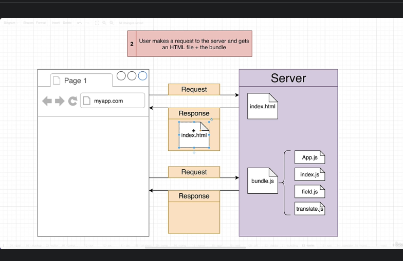
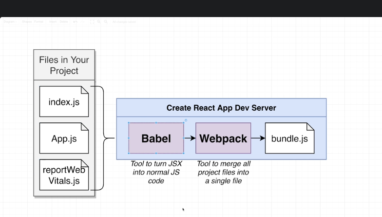
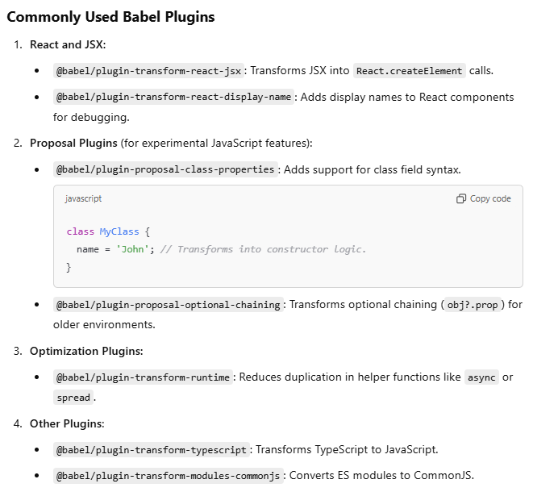
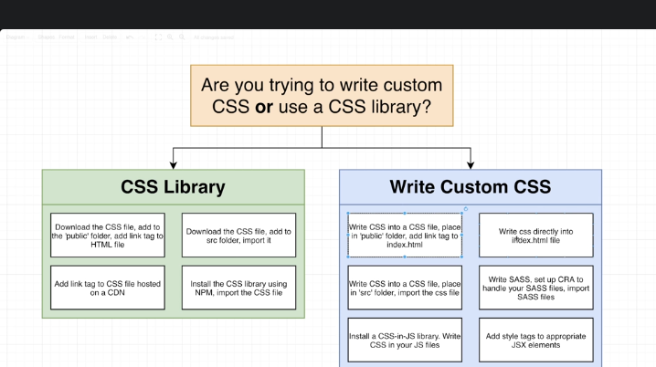

# Babel

Babel :  A transpiler to convert jsx to js
Webpack: Tool to merge all project files into single file

Babel is a JavaScript compiler that allows developers to write modern JavaScript code (ES6+ or beyond) and transform it into a backward-compatible version that can run in older browsers or environments that don't support the latest JavaScript features.

### Key features of Babel
- **Transpiling Modern JavaScript (ES6+) to Older JavaScript**
- **Plugin System**: The plugin system in Babel is one of its most powerful features. Babel plugins are pieces of code that transform specific aspects of your source JavaScript code during the compilation process. They allow developers to customize Babel’s behavior for tasks like syntax transformation, experimental feature support, or optimization.
 Plugin types: Syntax plugins, Transformation Ploginx, custom plugins

    - @babel/plugin-transform-react-jsx or
    - @babel/preset-react (a collection of Babel plugins for React, including JSX transformation).
 
 - **Preset system** :Presets are collections of plugins bundled for specific purposes.
    - @babel/preset-env: Automatically determines the JavaScript transformations needed for your target environments.
    - @babel/preset-react: Enables JSX transformations for React.
- **Polyfilling (via core-js)**: With the help of tools like @babel/polyfill or core-js, Babel can include missing functionality (e.g., Promise, Array.prototype.includes) in older environments.
- **Custom Transformations** : You can write your own Babel plugins to transform code according to your specific needs.

### How Does Babel Work?
Babel operates in three steps:

- Parsing: Converts your JavaScript code into an Abstract Syntax Tree (AST).
- Transformation: Applies plugins and presets to modify the AST.
- Generation: Converts the transformed AST back into JavaScript code.

### Image handling in babel
- Small images (<10KB): Webpack inlines them as Base64 Data URLs to avoid extra HTTP requests, improving load times for smaller assets.
- Large images (>10KB): Webpack copies them to the output directory and serves them as separate files, reducing bundle size.
- You can optimize images using additional loaders like image-webpack-loader and responsive-loader.

