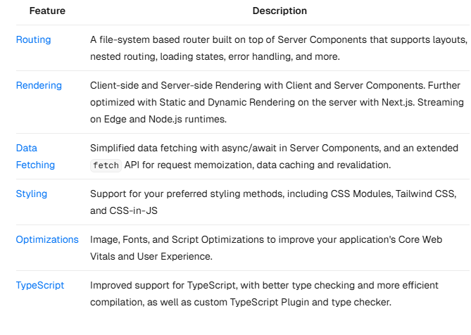
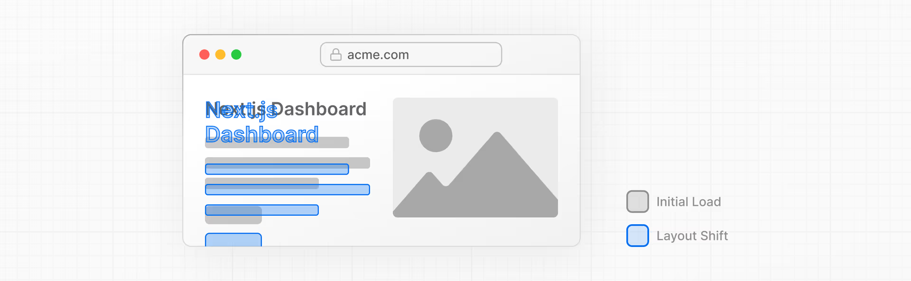

# Next JS

Next.js is a React framework for building full-stack web applications. You use React Components to build user interfaces, and Next.js for additional features and optimizations.

Under the hood, Next.js also abstracts and automatically configures tooling needed for React, like bundling, compiling, and more. This allows you to focus on building your application instead of spending time with configuration.



Behind the scenes, the components are split into two module graphs. The server module graph (or tree) contains all the Server Components that are rendered on the server, and the client module graph (or tree) contains all Client Components.
After Server Components are rendered, a special data format called the React Server Component Payload (RSC) is sent to the client. The RSC payload contains:

- The rendered result of Server Components.
- Placeholders (or holes) for where Client Components should be rendered and references to their JavaScript files.

React uses this information to consolidate the Server and Client Components and update the DOM on the client.

### Fonts in NextJS

Fonts play a significant role in the design of a website, but using custom fonts in your project can affect performance if the font files need to be fetched and loaded.

Cumulative Layout Shift is a metric used by Google to evaluate the performance and user experience of a website. With fonts, layout shift happens when the browser initially renders text in a fallback or system font and then swaps it out for a custom font once it has loaded. This swap can cause the text size, spacing, or layout to change, shifting elements around it.



Next.js automatically optimizes fonts in the application when you use the next/font module. It downloads font files at build time and hosts them with your other static assets. This means when a user visits your application, there are no additional network requests for fonts which would impact performance.

#### Why optimize images?

Next.js can serve static assets, like images, under the top-level /public folder. Files inside /public can be referenced in your application.

With regular HTML, you would add an image as follows:

```html

```

However, this means you have to manually:

 - Ensure your image is responsive on different screen sizes.
- Specify image sizes for different devices.
- Prevent layout shift as the images load.
- Lazy load images that are outside the user's viewport.

Image Optimization is a large topic in web development that could be considered a specialization in itself. Instead of manually implementing these optimizations, you can use the `next/image` component to automatically optimize your images.

The `<Image>` component
The `<Image>` Component is an extension of the HTML `` tag, and comes with automatic image optimization, such as:

- Preventing layout shift automatically when images are loading.
- Resizing images to avoid shipping large images to devices with a smaller viewport.
- Lazy loading images by default (images load as they enter the viewport).
- Serving images in modern formats, like WebP and AVIF, when the browser supports it.


