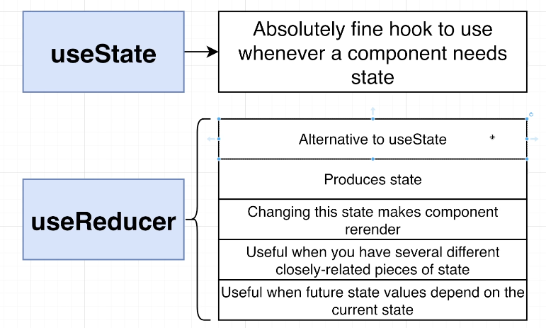

# React

#### Fast Refresh
Fast refresh is a React feature integrated into Next.js that allows you live reload the browser page while maintaining temporary client-side state when you save changes to a file. It's enabled by default in all Next.js applications on 9.4 or newer. With Fast Refresh enabled, most edits should be visible within a second

In general, Fast Refresh works with React 16.10 or later.

#### What is json-server?
json-server is a simple, lightweight tool that allows you to create a fake REST API quickly. It's ideal for prototyping, mock data, or testing front-end applications without needing a full backend.

With json-server, you can:

Create a RESTful API from a JSON file.
Perform CRUD (Create, Read, Update, Delete) operations.
Use query parameters to filter, sort, and paginate data.

``` bash
json-server --watch db.json --port 5000
```

#### prop-types
Its a JS library to validate the porps that get passed into your component
If someone passes down the incorrect kind of value ( number instead of boolean), a warning will appear in console
Used to be very popular. Now typescript does almost the samething

#### To install tailwaind in create-react-app project

```
npm install -D tailwindcss postcss autoprefixer
npx tailwindcss init -p
```

## Hooks


useEffect shouldn't return anything except a function (which is used for cleanup)


```js
// clearing eventlistener through useEffect

import { useState, useEffect } from "react";

function App() {
  const [counter, setCounter] = useState(0);

  useEffect(() => {
    function listener() {
      console.log(counter);
    }
    document.body.addEventListener("click", listener);

    return () => {
      document.body.removeEventListener("click", listener);
    };


  }, [counter]);

  return (
    <div>
      <button onClick={() => setCounter(counter + 1)}>+ Increment</button>
      <div>Count: {counter}</div>
    </div>
  );
}

export default App;

```

#### UseCallback

- Its a hook to help you tell React that your function isn't actually changing over time
- Fixes bugs around useEffect and other similar situations
- Follows similar conventions as useEffect


##### why is app making endless stream of requests ?
Everytime we fetch data, we udate state. When we re-render a new versio of ```fetchImages``` is created. The ```useEffect``` function runs again because it sees an element in its dependncy array has changed.

useCallback hook can be used to stop here, wrap fetch function in useCallback to fix this useCallback(fetchImages,[]) and then use it to call instead of fetchImages

#### Component vs page in react
A component is a resuasble react comonent that show s a handlful of elements
A Page is still a react component. Not intended to be reused


### Design System process
There are a total of 8 steps involved in this


#### Functional way of updating state


### Event capturing & bubbling

In web development, event capture and event bubbling are two phases of how events propagate through the DOM (Document Object Model). These concepts are part of the event flow mechanism, which describes how events travel through the DOM hierarchy when a user interacts with an element.

#### Event Flow Phases
##### Event Capturing Phase
Also called the "trickling phase".
Events propagate from the root element down to the target element.
In this phase, parent elements get a chance to handle the event before the target element is reached.
##### Target Phase
The event reaches the target element.
If an event listener is attached to the target element, it will be executed during this phase.
##### Event Bubbling Phase
Events propagate from the target element up to the root element.
In this phase, parent elements get a chance to handle the event after the target element has processed it.


### useRef
Allows a component to get a reference to a DOM element that it creates
Mostly it holds ref to DOM elements, but can also hold a value

- creates a ref to component by calling useRef, 
- assign ref to a JSX element as a prop called ref
- access that DOM element with ref.current


#### Standard browser behaviour
When the browser loads a new HTML doc, all existing JS variables and code is dumped


### Naviagation in React


window.location = xxxx 
The above causes a full page refresh

window.history.pushState({}, '','/dropdown')
Updates the address bar but doesn't cause a refresh


window emits a 'popstate' event if the user current url was added by 'pushState'

### Navigation Libraries

- React Router
- Wouter
- Reach-location
- Reach-Router


#### useReducer

<div style="display: flex; justify-content: space-between;">
  
  
</div>

``` js

// useReducer implementation

const reducer = (state, action) => {
  switch (action.type) {
    case 'INCREMENT':
      return { ...state, count: state.count + 1 };
    case 'DECREMENT':
      return { ...state, count: state.count - 1 };
    case 'VALUE_TO_ADD':
      return { ...state, valueToAdd: action.payload };
    case 'ADD_VALUE':
      return { ...state, count: state.count + state.valueToAdd, valueToAdd: 0 };
    default:
      return state;
  }
};

const [state, dispatch] = useReducer(reducer, {
  count: initialCount,
  valueToAdd: 0,
});

  function increment() {
  dispatch({ type: 'INCREMENT' });
}
```

### Immer
Immer is a tiny package that allows you to work with immutable state in a more convenient way.

Redux Toolkit (RTK), the official recommended approach for writing Redux logic, uses Immer under the hood. Immer simplifies the process of working with immutable state updates by allowing you to write code that "mutates" state directly, which Immer then converts into safe, immutable updates.

Here’s how it works in Redux Toolkit:

When you use createSlice or createReducer in RTK, you can write reducers that directly "mutate" the state.Immer ensures these mutations are actually translated into immutable updates, so your state remains immutable as per Redux's requirements.
### Redux
It is a state management library using same techniques as useReducer


With useReducer we only have one function to manage state, where as with redux we will have multiple reducer functions, each to manage diff part of state


slice automatically create reducers and actionTypes

```js
// sample redux store setup
import { configureStore, createSlice } from "@reduxjs/toolkit";

const songsSlice = createSlice({
  name: "song",
  initialState: [],
  reducers: {
    // state is not big state object, its only piece of state managed by this reducer
    addSong(state, action) {
      state.push(action.payload);
    },
    removeSong(state, action) {},
  },
});

const store = configureStore({
  reducer: {
    songs: songsSlice.reducer,
  },
});

console.log(store);
const startingState = store.getState();
console.log(JSON.stringify(startingState));
store.dispatch({
  type: 'song/addSong',
  payload: 'New song'
})

console.log(JSON.stringify( store.getState()));
console.log(songsSlice.actions)
console.log(songsSlice.actions.addSong('sdfsdff'))

store.dispatch(songsSlice.actions.addSong('secret'))
console.log(JSON.stringify( store.getState()));

```

##### Slices
- Defines some initial state
- Combines 'mini-reducers' into a big reducer
- Creates a set of 'action creator' functions

The mini-reducers written in slice are like case statements we write in  a reducer, createSlice functions combines them to create a single reducer, that is the reason we are referring to it as songsSlice.reducer while configuring store


 


|  |  |
|-------------------------|-------------------------|


### React Router


 


## React 19

useOptimistic
useTransition
useRef
use

### Components:
#### Fragment: 
for using key on these, <></> can't be used
<Fragment key={yourKey}>...</Fragment>
https://codesandbox.io/p/sandbox/react-fragement-8lczmq


#### Profiler: 
 lets you measure rendering performance of a React tree programmatically.

 https://codesandbox.io/p/sandbox/x98wyv?file=%2Fsrc%2FApp.js%3A31%2C11

 #### Strict Mode
 Use StrictMode to enable additional development behaviors and warnings for the component tree inside:
 Strict Mode always calls your rendering function twice, so you can see the mistake right away 

 ```
 import { StrictMode } from 'react';
import { createRoot } from 'react-dom/client';

const root = createRoot(document.getElementById('root'));
root.render(
  <StrictMode>
    <App />
  </StrictMode>
);
```

https://react.dev/reference/react/StrictMode#usage